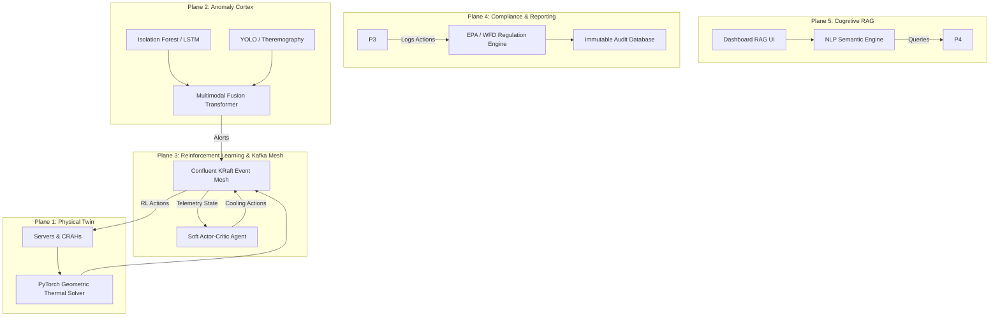

# HydroTwin OS — Architecture Whitepaper

**HydroTwin OS** is an AI-native Operating System designed to autonomously navigate the Water-Energy-Carbon Nexus in Hyperscale Data Centers. 

Instead of treating cooling, grid carbon, and localized water stress as separate deterministic problems, this repository fuses them into a continuous **Reinforcement Learning Matrix** overlaid on a real-time **Kafka Event Mesh**.

## The 5-Plane Cognitive Architecture

The operating system operates across five distinct architectural planes, ensuring high availability (HA), catastrophic decoupling (the failure of one plane does not crash the datacenter), and mathematical bounds on actions.



---

## Technical Deep-Dive

### 1. Plane 1: The Physics Twin (Thermal GNN)
Running standard CFD (Computational Fluid Dynamics) inside a control loop is computationally impossible (~5 hrs per step). Instead, we use a **PyTorch Geometric Graph Neural Network (GNN)**. 
- Transcribes the datacenter into an `AssetGraph` (Sources=CRAHs, Sinks=Servers).
- Approximates the CFD heat-diffusion envelope mathematically in `~184ms`, enabling 5Hz continuous reinforcement learning.

### 2. Plane 2: Multimodal Anomaly Cortex
A transformer-based sensor fusion engine checking 3 concurrent modalities:
1. **Time-Series Telemetry**: (Fans, PUE, Inlet temps) via `IsolationForest` and `LSTM Autoencoders`.
2. **Computer Vision**: (Thermography and Visual Leak Detection) via `Ultralytics YOLOv8`.
3. **Acoustic**: (Pump cavitation and motor grinding) via FFT (Fast Fourier Transform).

*Event Flow*: If an anomaly occurs (e.g., a pump leak), the `AlertEngine` fires a Pydantic-validated payload (`anomaly.alerts`) directly into Kafka, which the RL agent processes as an exogenous state hazard.

### 3. Plane 3: Reinforcement Learning Matrix
The central nervous system. A **PyTorch Soft Actor-Critic (SAC)** algorithm mapped to a continuous continuous `DataCenterEnv`.
- **The Pareto Reward Factor**: Optimization isn't just about saving electricity. The agent dynamically shifts weights (`alpha` and `gamma`) based on live external grid API pings (`ElectricityMaps`). 
- **Behavior**: If the grid asserts high relative carbon (e.g. coal peaking), the agent shifts the cooling burden from electrical chillers to **adiabatic evaporative cooling** (consuming water to save carbon). If localized water stress peaks (`WRI Aqueduct` API), the agent shifts back to pure electricity.

### 4. Plane 4: Zero-Trust Regulatory Compliance
Data centers face mounting regulatory pressure (e.g., EU Energy Efficiency Directive). The `RegulationEngine` intercepts every RL action and twin metric, asserting it against threshold limits (e.g. EPA max water withdrawal limits). 
Every decision is pushed to an append-only `AuditTrail` coupled with an `ExplainabilityEngine` to prevent Black-Box AI accusations.

### 5. Plane 5: Generative Semantic UI
A natural-language interface attached to the live Dashboard (`FastAPI + HTML`). Operators can bypass complex telemetry dashboards to ask questions like: *"Why did the evaporative cooling spike?"* The RAG matrix parses the `AuditTrail`, `Kafka Mesh`, and the mathematical bounds of the `ParetoReward` to provide localized conversational responses.

---

## 🚀 Running the Datacenter Scenario

To see the 5 planes interact locally:

1. **Spin up the Core Platform:**
   ```bash
   docker compose up -d
   ```
   *(Launches Kafka KRaft, Zookeeper, InfluxDB, Prometheus, and Grafana).*

2. **Boot the Anomaly Coprocessor:**
   ```bash
   python scripts/run_anomaly_node.py
   ```
   *(Initializes the LSTM sensors, Vision systems, and Transformer fusions, hooking them to `hydrotwin.telemetry`).*

3. **Ignite the Physics Twin & RL Matrix:**
   ```bash
   python scripts/run_live_datacenter.py
   ```
   *(Hooks the simulated `DataCenterEnv` to the RL Agent and establishes the continuous Event Mesh cycle).*

4. **Launch the Plane 5 Terminal:**
   ```bash
   python -m uvicorn hydrotwin.dashboard.server:app --host 0.0.0.0 --port 8000
   ```
   *(Navigate to `http://localhost:8000` to interact with the system live).*
